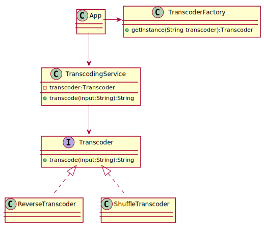
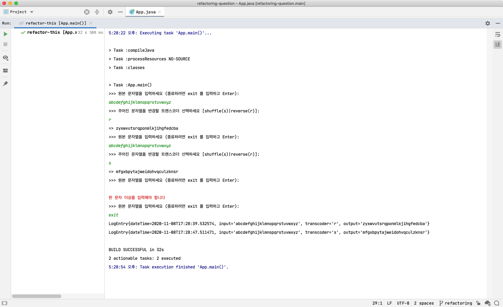

## 설계

- 흐름을 제어한다
- 사용자로부터 문자열을 입력을 받는다
- 입력받은 문자열을 트랜스코드한다
- 트랜스코드된 문자열을 출력한다

## Q1: Refactoring

의존성 주입, 의존 역전 원칙, 팩토리 패턴을 이용하여 아래 그림과 같이 리팩토링하시오.

## Q2: Feature

`exit`를 입력하여 프로그램을 종료할 때, 다음의 실행 이력을 출력하시오.
- 실행시각
- 원본 문자열
- 트랜스코더
- 결과값

## Q3: Feature

실행 이력을 파일로 출력하도록 프로그램을 고치시오

## 실행 예

